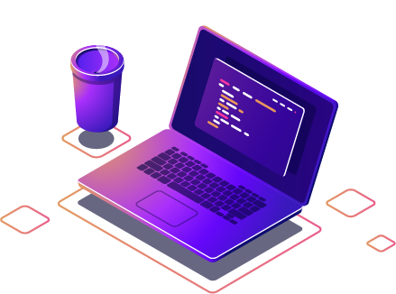

  

## 💜 Olá, meu nome é Geovanna!

Estou no 4º semestre de <strong>Ciência de Dados e Machine Learning</strong> e, na prática, aprendo fazendo. Durante minha experiência na área da saúde, identifiquei problemas reais de processo e estruturei soluções em Excel e automações, usando ferramentas de IA para viabilizar a parte técnica.

Isso me mostrou que gosto de resolver problemas com dados e tecnologia, e agora quero aprofundar de verdade em <strong>Python, bancos de dados, Business Intelligence e engenharia de software</strong>. Também sou apaixonada por arte, o que me ajuda a enxergar a tecnologia sob outras perspectivas e manter a criatividade viva no que faço. Sou proativa, aprendo rápido e não tenho medo de assumir um problema que ninguém mais quis resolver.

Busco aplicar o que já sei e aprender o que ainda não sei, na prática.

 

### Linguagens e ferramentas

  
  &nbsp;
  
  &nbsp;
  
  &nbsp;
  

  Noções básicas de:
  
  
  

### Vamos nos conectar!

  
  

 

  

